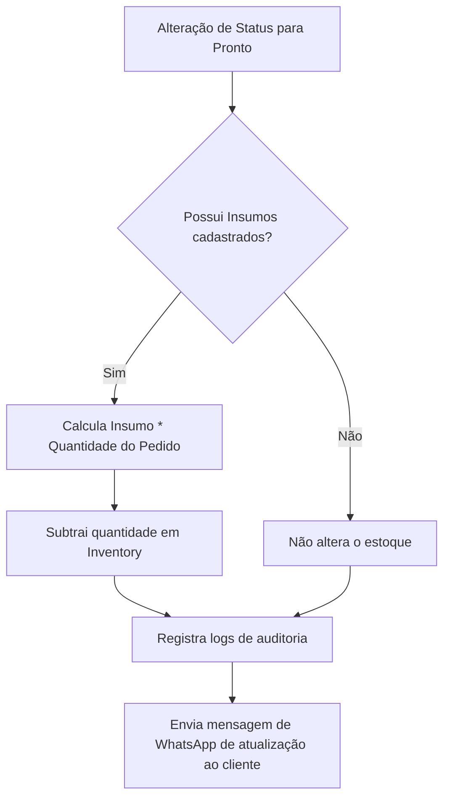

# Plano de Garantia de Qualidade (QA Plan) — EstampariaPro

Este documento estabelece a metodologia de testes para validar a estabilidade das atualizações e novas funcionalidades implementadas nas versões `v21.7` e `v21.8`.

---

## 1. Estratégia de Testes

### 1.1. Testes Unitários e Integração (Serviços e Helpers)
- **Supabase Connectivity:** Validar se a instância global do Supabase em `supabase.ts` responde adequadamente a chamadas assíncronas e respeita as credenciais locais.
- **Tenant Management & Isolation:** Garantir que o isolamento RLS (Row Level Security) não permita vazamento de dados de inquilinos diferentes nas buscas de pedidos, clientes e produtos.
- **Audit Logs Creation:** Testar o envio de ações ao `auditService.ts` e certificar que a inserção na tabela `audit_logs` persista informações exatas de `tenant_id`, `user_email` e payloads estruturados.

### 1.2. Testes Funcionais e de Fluxo Completo
- **Baixa de Estoque:** Cadastrar um produto e sua receita (ingredientes em `InventoryItem`), simular a criação de um pedido com este item e sua transição de status para `OrderStatus.FINISHED`, verificando se a quantidade de insumos diminui exatamente de acordo com o cálculo de ingredientes.
- **Envio de WhatsApp:** Alterar o status de um pedido e verificar o acionamento do gatilho dinâmico `whatsappService.sendMessage` com formatação estilizada de texto.

---

## 2. Cobertura de Fluxos de Negócio Críticos

---

## 3. Ambiente de Validação

- **Client Server Build:** O sistema deve compilar para produção (`npm run build`) de forma totalmente livre de avisos de tipagem TypeScript ou caminhos incorretos.
- **Performance State Caching:** Validar que consultas subsequentes em views que utilizam queries assíncronas sejam resolvidas através do cache do React Query em vez de bater diretamente no Supabase em cada alteração visual.
